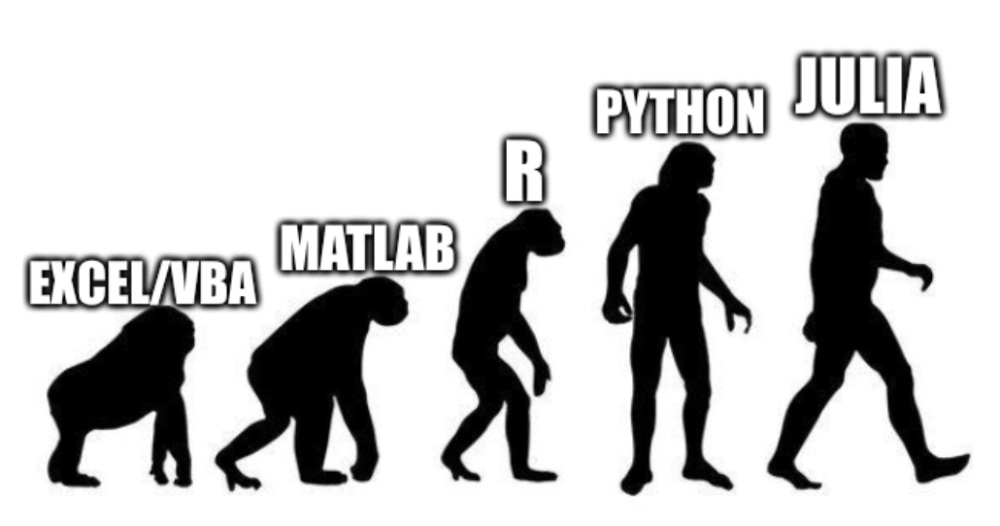

I got my PhD in Statistics in 2000 from [Stockholm University](https://www.su.se/department-of-statistics/) on the topic Bayesian Cointegration with the brilliant Daniel Thorburn as supervisor. 

After my post doc I was senior lecturer at Stockholm University (2003-2011) and researcher and advisor at the Swedish central bank (2004-2011), where I was part of a team that developed the two main models for macroeconomic forecasting and policy analysis.

I have been Professor of Statistics at Linköping University since 2011, where I have spent time building up the [Statistics and Machine Learning](https://liu.se/en/organisation/liu/ida/stima) division.

I am currently back at my alma mater at Stockholm University, now as Professor Statistics (2018-). 

I serve as associate editor for [Bayesian Analysis](https://projecteuclid.org/journals/bayesian-analysis) (2020-) and [Econometrics & Statistics](https://www.journals.elsevier.com/econometrics-and-statistics) (2015-).

I enjoy programming and my language evolution is:

